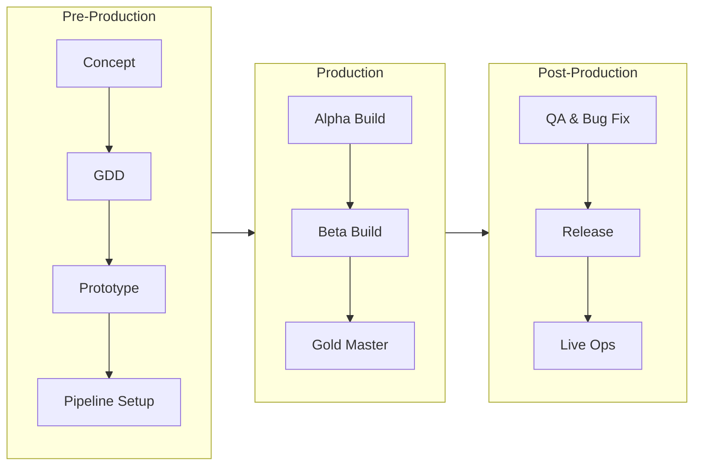

```mermaid
flowchart LR
subgraph PRE["Pre-Production"]
A[Concept] --> B[GDD]
B --> C[Prototype]
C --> D[Pipeline Setup]
end
subgraph PROD["Production"]
E[Alpha Build] --> F[Beta Build]
F --> G[Gold Master]
end
subgraph POST["Post-Production"]
H[QA & Bug Fix] --> I[Release]
I --> J[Live Ops]
end
PRE --> PROD --> POST
```
