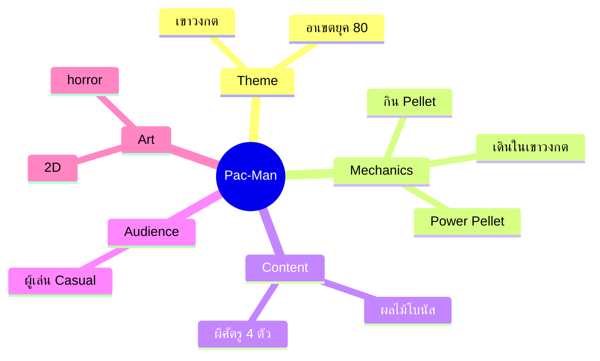
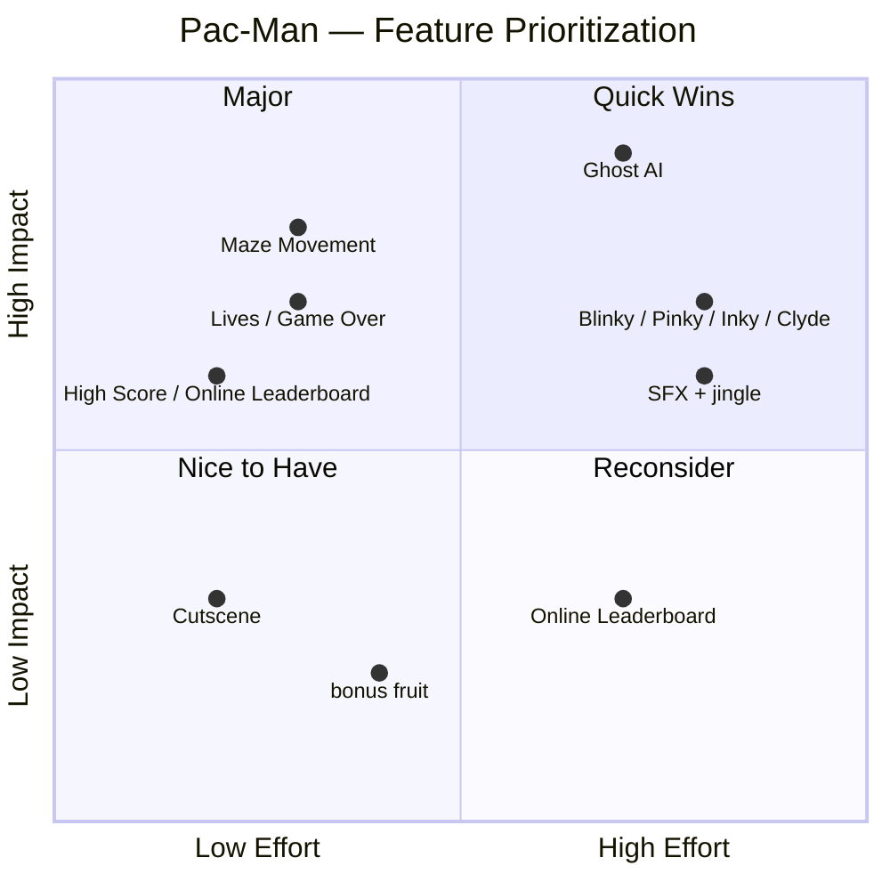
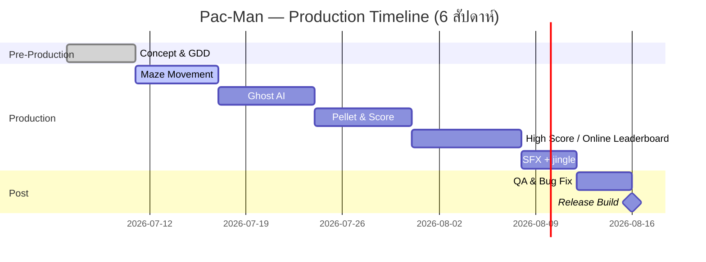

```mermaid
mindmap
	root((Pac-Man))
		Theme
			เขาวงกต
			อาเขตยุค 80
		Mechanics
			เดินในเขาวงกต
			กิน Pellet
			Power Pellet
		Content
			ผีศัตรู 4 ตัว
			ผลไม้โบนัส
		Audience
			ผู้เล่น Casual
		Art
			2D
			horror
```

```mermaid
quadrantChart
	title Pac-Man — Feature Prioritization
	x-axis Low Effort --> High Effort
	y-axis Low Impact --> High Impact
	quadrant-1 Quick Wins
	quadrant-2 Major
	quadrant-3 Nice to Have
	quadrant-4 Reconsider
	Maze Movement: [0.3, 0.8]
	Ghost AI: [0.7, 0.9]
	Online Leaderboard: [0.7, 0.3]
	Cutscene : [0.2, 0.3]
	High Score / Online Leaderboard : [0.2, 0.6]
	SFX + jingle: [0.8, 0.6]
	bonus fruit: [0.4,0.2]
	Blinky / Pinky / Inky / Clyde : [0.8,0.7]
	Lives / Game Over:[0.3,0.7]
```

```mermaid
gantt
title Pac-Man — Production Timeline (6 สัปดาห์)
dateFormat YYYY-MM-DD
section Pre-Production
Concept & GDD :done, c1, 2026-07-06, 5d
section Production
Maze Movement :active, p1, after c1, 6d
Ghost AI : p2, after p1, 7d
Pellet & Score : p3, after p2, 7d
High Score / Online Leaderboard : p4 ,after p3,8d
SFX + jingle :p5 ,after p4,4d
section Post
QA & Bug Fix : q1, after p5, 4d
Release Build :milestone, m1, after q1, 0d
```
